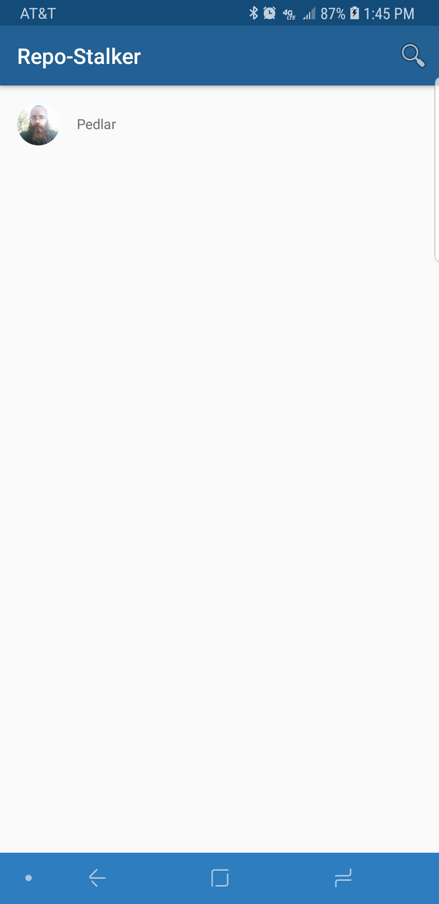

# GitHub Profile Followers
This app helps users search followers of a GitHub user.

## Installation:
You should be able to clone the project and run it on Android Studio.

## Libraries:
* Android Support Library [AndroidX].
* Android Architecture Components: LiveData & ViewModel [AndroidX].
* Android Espresso [AndroidX].
* Picasso.
* Retrofit.

## A few enhancements to keep in mind:
* Continue adding details to list of followers.
* Add unit testing.

## Screenshots:

